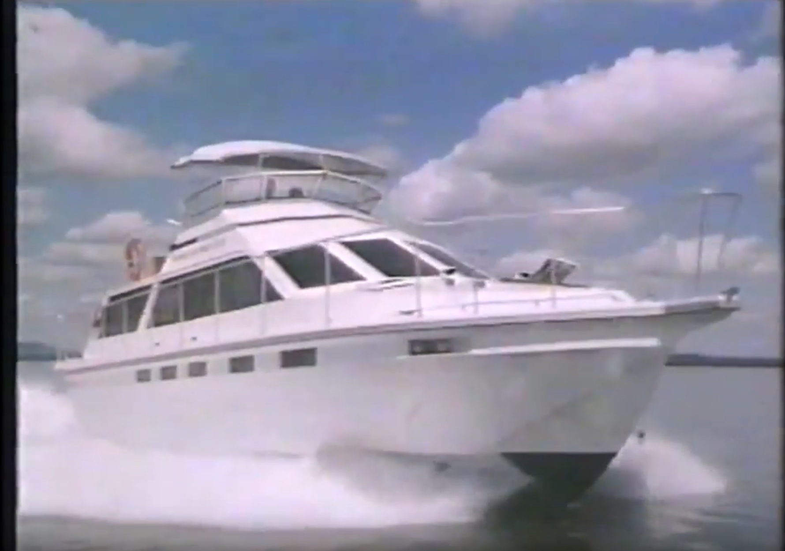
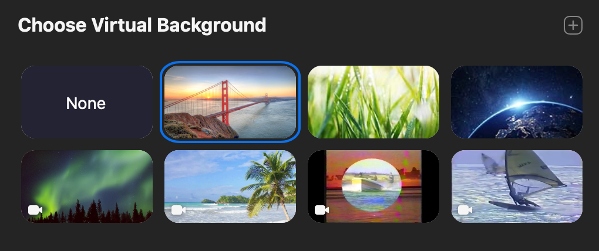

## Why limit yourself non-moving Zoom backgrounds?
_requires Zoom 4.6.4_

Did you know you can add video backgrounds with Zoom? This quick tutorial will show you how to visit the 1980s on every video call. 

First, we need some tools. 

`brew install youtube-dl` or the equivalent for your OS. 

If you want to use the video from the screenshot above:

`youtube-dl -F 'https://www.youtube.com/watch?v=GsN_9a257rM'` 

and then choose the appropriate stream, ie `youtube-dl -f 18 'https://www.youtube.com/watch?v=GsN_9a257rM'`

_Zoom requires a minimum resolution of 640x360 for virtual backgrounds_ 

Next, go to Zoom preferences and add the video you just downloaded. 

Proceed to enjoy the 1980s
